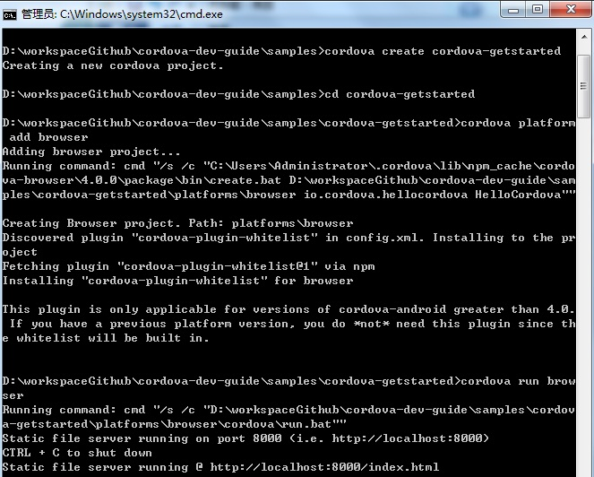
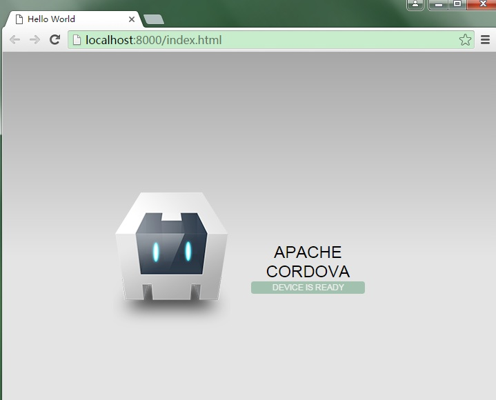
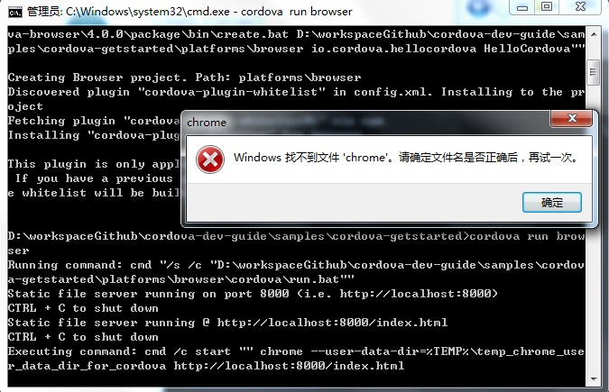

快速开始
====

本文介绍了如何用 Cordova 快速构建一个应用。

## 安装 Cordova

Cordova 命令行运行于 [Node.js](http://nodejs.org/) 环境，可以通过 [NPM](https://npmjs.org/package/cordova)，进行安装。

```
$ npm install -g cordova 
```

**注：**国内环境下，可以设置 NPM 镜像，来使安装加速。参见[《加速 npm》](http://www.waylau.com/faster-npm/)

## 创建项目

使用命令行创建一个空项目。切换到任意目录下，执行 `cordova create <path>` 来创建项目,本例的项目名称为`cordova-getstarted`

```
$ cordova create cordova-getstarted
```

## 添加平台

项目创建后，切换到项目下，执行 `cordova platform add <platform name>` 来添加你所期望构建项目的平台。本例的平台是`browser`,即在浏览器中运行。

执行 `run cordova platform` 可以看到所能执行添加的平台。

```
$ cd cordova-getstarted

$ cordova platform add browser
```

## 运行 app

执行 `cordova run <platform name>` 即可。

```
$ cordova run browser
```



浏览器会自动运行，效果如下




## 问题

### 问题1：报“找不到chrome”错误



解决方法1：安装 chrome 浏览器即可。

解决方法2：非 chrome 浏览器网址访问 <http://localhost:8000/index.html> 即可


## 源码

* 见 <https://github.com/waylau/cordova-dev-guide> 的`samples` 目录下 `cordova-getstarted`